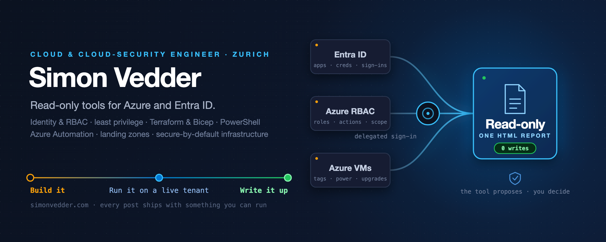

  
  
  

**Cloud & cloud-security engineer near Zurich.** I work across Azure platform engineering and cloud
security, with a focus on Microsoft Entra ID, RBAC and infrastructure-as-code. The tools below are
small and read-only by default, tested against live tenants, and written up at
**[simonvedder.com](https://simonvedder.com)**.

## Tools

| Tool | What it does | Ships as |
|---|---|---|
| **[AzureInPlaceUpgrade](https://github.com/simon-vedder/azure-vm-inplace-upgrade)** | Tag-driven, unattended in-place upgrades of Windows Server on Azure VMs: preflight, snapshot, detached Setup, Azure Automation state machine, Log Analytics workbook | PowerShell Gallery module + Bicep deploy |
| **[Least Privilege Studio](https://github.com/simon-vedder/least-privilege-studio)** | Find the minimal Azure RBAC role that covers a set of actions and generate the assignment | [Web app](https://simon-vedder.github.io/least-privilege-studio/) |
| **[App Lifecycle Analyzer](https://github.com/simon-vedder/app-lifecycle-analyzer)** | Read-only lifecycle audit of Entra ID app registrations: secrets, certs, federated credentials, sign-in activity | PowerShell script → HTML report |
| **[Azure VM Power Management](https://github.com/simon-vedder/azure-vm-power-management)** | Tag-driven start/stop for Azure VMs via an `AutoShutdown` tag | Runbook + Terraform |
| **[Terraform Secrets](https://github.com/simon-vedder/terraform-secrets)** | Rotate Terraform-provisioned VM credentials via Key Vault + Automation, no plaintext in state | Runbook + Terraform |
| **[Azure VM Self-Service Order](https://github.com/simon-vedder/azure-vm-selfservice-order)** | Self-service VM / AVD ordering via a web form: Logic App, Queue, Function App | Terraform blueprint |
| **[Aria Cloud](https://github.com/simon-vedder/aria-cloud)** | Enterprise RAG on Azure AI Foundry with private networking | Terraform + FastAPI blueprint |

Collections: **[powershell](https://github.com/simon-vedder/powershell)** (RiskyRolesAnalyzer, NSG audit, OS inventory, tag audit) ·
**[terraform-azure](https://github.com/simon-vedder/terraform-azure)** · **[bicep](https://github.com/simon-vedder/bicep)** ·
**[arm](https://github.com/simon-vedder/arm)** · **[kql](https://github.com/simon-vedder/kql)**

## Currently building

- **RiskyRolesAnalyzer as a proper module.** Azure RBAC and Entra privileged roles in one snapshot: escalation paths through custom-role actions, nested groups, PIM eligibles, dormant privileged app registrations, with `-WhatIf`-first cleanup. Same pattern as AzureInPlaceUpgrade: Gallery module, Pester, release workflow.
- **AzureInPlaceUpgrade** toward 1.0: the remaining paths of the upgrade matrix, plus the blog series.

## Upstream

- [maester365/maester #2130](https://github.com/maester365/maester/pull/2130): MT.1198, a test for app registration certificate lifetime.
- [Azure/Community-Policy #541](https://github.com/Azure/Community-Policy/pull/541): two DeployIfNotExists policies that roll out the Entra login extensions to Windows and Linux VMs.

## Latest posts

<!-- BLOG:START -->
- [169.254.169.254: The Cloud Metadata Endpoint](https://simonvedder.com/169-254-169-254-the-cloud-metadata-endpoint/) · 2026-08-27
- [There's no built-in policy for Entra VM login](https://simonvedder.com/theres-no-built-in-policy-for-entra-vm-login/) · 2026-07-26
- [Stop letting your AI guess Azure RBAC](https://simonvedder.com/stop-letting-your-ai-guess-azure-rbac/) · 2026-06-29
<!-- BLOG:END -->

More at [simonvedder.com](https://simonvedder.com) · [LinkedIn](https://www.linkedin.com/in/simon-vedder/)
